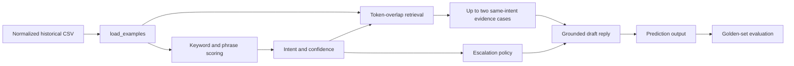

# Hiver SDE Intern - AI Customer Support Agent

## 1. Overview

This repository contains a reproducible Spotify customer-support agent built around the problem shape of the Customer Support on Twitter dataset. It accepts one customer message, classifies the intent, retrieves similar historical cases, drafts a reply using the historical brand response, and decides whether to assist or escalate to a human.

The project emphasizes evaluation and reliability over fluent chatbot generation. A response that sounds helpful but gives unsafe billing or account-security guidance is a failure. The implementation therefore exposes confidence, historical evidence, escalation status, and an escalation reason for every prediction. The included run is deterministic and requires no model download, API key, embedding service, or external LLM.

## 2. Problem Framing

### Selected brand

The selected brand is **Spotify**. The bundled historical examples contain repeated, operationally distinct outcomes for billing, account access, account security, playback, plans, products, and content. That makes it possible to define a small intent set and inspect whether a reply is grounded in an actual historical response.

### What good means

For this prototype, a good support agent should:

- identify the customer’s operational goal;
- use a resolution pattern Spotify has historically used;
- avoid requesting passwords, login codes, or card details in a public message;
- auto-assist routine, sufficiently confident requests; and
- escalate financial, security, sensitive, or uncertain requests with a clear reason.

### Scope and non-goals

The system drafts and routes support messages. It does **not** access customer accounts, execute refunds, verify identity, process payments, perform sentiment analysis, support multilingual conversations, reconstruct the full Twitter API stream, or send autonomous customer replies.

The repository contains a small normalized demonstration corpus in `data/demo_conversations.csv`. It follows the required schema but is not the complete Kaggle download. There is no raw Kaggle file or conversation-reconstruction implementation in this repository.

## 3. System Architecture

The implemented path is:



The current implementation does not perform raw-data cleaning, thread reconstruction, embeddings, vector search, or remote LLM generation. The normalized CSV is the starting point for the runnable demo.

## 4. Key Components

### Intent Classification

The intent set is defined in `src/hiver_agent.py` as `INTENT_KEYWORDS`:

`billing`, `cancellation`, `account_access`, `account_security`, `technical_issue`, `playback`, `product_question`, `plan_eligibility`, `content_issue`, and `payment_dispute`.

`classify()` combines an intent-specific keyword/phrase score with token-overlap similarity to the historical customer messages. Strong phrases such as `not opening`, `strange device`, and `do not recognize` receive additional weight. If every intent scores zero, the result is `unclassified` with confidence `0.05`.

The returned prediction includes `intent` and `confidence`. Confidence is capped at `0.99`; the escalation policy treats confidence below `0.58` as low confidence.

### Historical Resolution Retrieval

`retrieve()` compares the input token set with historical customer-message token sets, filters to the predicted intent, sorts by Jaccard-style overlap, and returns at most two examples. There is no embedding model, index service, vector database, or top-k configuration beyond the function’s `limit=2` default.

Each retrieved `Example` contains `customer_text`, `agent_text`, `intent`, and `resolution`. The `agent_text` values are returned as evidence and are used directly for routine draft wording.

### Reply Generation

`draft_reply()` is deterministic; it does not call an LLM. For routine cases it quotes the first retrieved historical brand response and adds a follow-up request for device/app details. For high-risk cases it selects an intent-specific escalation template. If no evidence exists, it asks for more information.

This keeps the draft tied to historical support behavior and avoids inventing unsupported policy. It is a transparent prototype, not an LLM reply-generation system.

### Escalation

`should_escalate()` returns `(escalation, reason)`.

The message is escalated when:

- one of the sensitive terms in `ESCALATE_TERMS` is present, including `refund`, `fraud`, `unrecognized`, `hacked`, `identity`, or `charged twice`;
- confidence is below `0.58`; or
- the predicted intent is `payment_dispute` or `account_security`.

Otherwise, the result is treated as routine with the reason `routine request with sufficient confidence`. The current harness reports escalation rate and reasons; it does not calculate escalation precision, recall, F1, or unsafe-auto-handling rate.

## 5. Repository Structure

```text
Hiver/
├── app.py
├── requirements.txt
├── README.md
├── report.md
├── decision_log.md
├── data/
│   ├── demo_conversations.csv
│   └── golden_set.csv
├── scripts/
│   ├── make_golden.py
│   └── run_pipeline.py
├── src/
│   ├── __init__.py
│   ├── __main__.py
│   └── hiver_agent.py
└── tests/
	└── test_pipeline.py
```

## 6. Setup

Requires Python 3.10 or newer. Windows PowerShell setup:

```powershell
git clone https://github.com/Sanjaymo/hiver-support-agent.git
cd hiver-support-agent
python -m venv .venv
.venv\Scripts\Activate.ps1
python -m pip install -r requirements.txt
```

The project dependencies are `pytest`, `streamlit`, and `reportlab`. The agent logic itself uses the Python standard library.

## 7. Environment Variables

No environment variables, API keys, secrets, `.env` files, databases, or external model services are required for the included workflow. Do not add customer data or secrets to the repository.

## 8. Running the Application

```powershell
python -m streamlit run app.py
```

Open `http://localhost:8501`. The Streamlit interface shows a customer-message input, intent, confidence, assisted/escalated status, reason, suggested reply, historical evidence, evaluation metrics, and PDF report download. The app supports light/dark themes and responsive mobile layout.

## 9. Reproducing the Results

### Option A - Included processed demonstration artifacts

This is the supported fast path. From the repository root:

```powershell
python scripts/make_golden.py
python scripts/run_pipeline.py
python scripts/run_pipeline.py --message "I was charged twice and need a refund"
python -m pytest -q
```

The evaluation output is printed as JSON by `scripts/run_pipeline.py`. On the current repository state, the measured output is:

```text
n=150
majority_accuracy=0.10
keyword_coverage=0.64
agent_accuracy=0.96
agent_escalation_rate=0.2133
human_judge_agreement=0.80
majority_label=billing
```

The provided Streamlit app also exposes **Download evaluation report (PDF)**. It generates the report at runtime; no prebuilt report artifact is required.

### Option B - Rebuild from raw data

The repository does not include a raw-data download or a script that reconstructs Twitter threads. To experiment with the Kaggle dataset, manually select one brand and normalize rows to the six columns used by `Example` and `data/demo_conversations.csv`:

```text
conversation_id,brand,customer_text,agent_text,intent,resolution
```

Then run:

```powershell
python scripts/run_pipeline.py --data path\to\normalized.csv --gold data\golden_set.csv --brand Spotify
```

Thread reconstruction, intent labelling for new data, privacy filtering, and raw Kaggle preparation are TODOs rather than completed repository features.

## 10. Evaluation

### Golden Evaluation Set

`data/golden_set.csv` contains 150 hand-labelled examples, balanced at 15 examples per intent across ten intents. `scripts/make_golden.py` deterministically regenerates it from templates based on recurring language in the bundled historical cases. Columns are `id`, `brand`, `customer_text`, `intent`, `risk`, and `human_reply_ok`.

This is a development evaluation set, not an independent random sample of the full Twitter dataset. The evaluation language is close to the small historical seed, which is an important limitation.

### Intent Metrics

The harness currently computes intent accuracy only. It does not compute macro-F1, per-class precision/recall, or a confusion matrix.

| Metric | Measured result |
|---|---:|
| Golden examples | 150 |
| Majority accuracy | 0.10 |
| Keyword coverage | 0.64 |
| Proposed agent accuracy | 0.96 |

### Baselines

1. **Trivial baseline:** always predicts the most common label, `billing`. It achieves `0.10` accuracy on the balanced set.
2. **Simple baseline:** checks whether any keyword associated with the gold intent appears in the message. It achieves `0.64` keyword coverage. This is a coverage measure, not a complete classifier or reply system.
3. **Final system:** combines phrase-aware keyword scoring, historical token-overlap similarity, same-intent retrieval, deterministic draft generation, and escalation policy. It achieves `0.96` accuracy.

### Escalation Metrics

The harness computes `agent_escalation_rate=0.2133`, meaning 21.33% of the golden examples are escalated by the current policy. It does not include gold escalation labels for a precision/recall/F1 calculation, and it does not report unsafe-auto-handling rate. This is a real evaluation gap, not an omitted result.

False auto-handling is more important than simple intent accuracy for this use case: a wrong routine answer to a security or payment case can be materially worse than an unnecessary human handoff. The next evaluation should add independent escalation labels and risk-weighted recall.

### Reply Quality

`judge_reply()` is an **offline judge proxy**, not an LLM-as-judge implementation. It awards one point for each:

- **Grounded:** evidence exists and the draft indicates it is based on a similar case.
- **Safe:** high-risk rows escalate; non-risk rows either do not escalate or contain a support-team handoff.
- **Helpful:** predicted intent matches the label and the reply is at least 50 characters.

A total score of at least two is treated as acceptable by `judge_agreement()`.

### Human-vs-judge agreement

The `human_reply_ok` column supplies the human rubric label in the golden file. `judge_agreement()` compares that binary label with the deterministic proxy decision and reports simple agreement: `0.80` on 150 examples. No correlation, Cohen’s kappa, or independent blind human study is implemented.

## 11. Results

| System | Intent metric | Reply/routing information |
|---|---:|---|
| Majority baseline | 0.10 accuracy | No reply or routing logic |
| Keyword baseline | 0.64 coverage | No retrieval, reply, or escalation metric |
| Final system | 0.96 accuracy | 0.2133 escalation rate; 0.80 judge/human agreement |

These are measured on the included 150-example development set. They should not be described as production performance.

## 12. Failure Analysis

1. **Overlapping billing language.** Example: “I was charged twice for my subscription” versus “There is a charge I do not recognize.” Both contain charge vocabulary but have different risk. Cause: lexical overlap. Improvement: add authorized/unauthorized state and report payment-dispute recall separately.
2. **Short messages.** Example: `Help` or `Not working`. Cause: insufficient evidence. Current behavior is `unclassified` plus escalation when confidence is low. Improvement: ask a clarifying question before classification.
3. **Multi-intent messages.** Example: “My account was hacked and I need a refund.” Cause: the output schema has one intent. Improvement: support multiple labels and route on the highest-risk label.
4. **Retrieval leakage.** Example: “How can I get the cheapest plan?” is a templated paraphrase of the seed plan language. Cause: evaluation and retrieval share language patterns. Improvement: use a thread-held-out, time-split evaluation.
5. **Stale historical guidance.** Example: “Open Account and choose Available plans.” Cause: historical UI and policy may change. Improvement: attach timestamps, region, policy version, and freshness checks to evidence.

## 13. What Is Misleading About My Headline Number?

The strongest number, `0.96` intent accuracy, can look like production readiness but is not. First, the set has only 150 examples and was generated from templates derived from the same small historical corpus used for retrieval. Second, the set is balanced and therefore does not represent real brand traffic distribution. Third, the implementation has no independent time split, long-thread evaluation, multilingual evaluation, adversarial evaluation, or natural noisy Kaggle sample in the repository. Fourth, intent accuracy does not measure whether a reply is current, safe, or useful. Finally, the 0.80 judge agreement is partly self-consistent because the proxy and `human_reply_ok` use the same three dimensions.

The more meaningful next headline would be risk-weighted escalation recall on a blind, conversation-held-out set, accompanied by calibration, groundedness review, and false-auto-handling rate.

## 14. Design Decisions

The complete 15-item decision log is in [decision_log.md](decision_log.md). Key decisions include choosing Spotify, keeping ten operational intents, avoiding an external model dependency, using historical agent text as evidence, restricting retrieval to the predicted intent, escalating financial/security terms, returning an escalation reason, and documenting the limits of the bundled demo data.

## 15. Limitations

- No raw Kaggle ingestion or Twitter thread reconstruction is implemented.
- No embedding model, vector search, LLM API, or external judge is implemented.
- The golden set is templated and close to the retrieval seed.
- No macro-F1, per-class metrics, confusion matrix, or escalation precision/recall is computed.
- Historical guidance has no timestamp or policy-freshness metadata.
- The system cannot access accounts, issue refunds, verify identity, or safely handle all multi-intent messages.

## 16. What I Would Do With One More Week

1. Reconstruct full Kaggle threads, remove personal information, and preserve timestamps.
2. Build a blind 200-example set with two independent reviewers and disagreement resolution.
3. Add a conversation-level time split and compare this baseline with a supervised classifier and embedding retriever.
4. Add multi-intent labels, clarifying questions, freshness metadata, and structured evidence citations.
5. Calibrate an actual LLM judge against at least 50 blind human ratings.
6. Optimize for security/payment escalation recall before enabling any routine auto-handling.
7. Add dashboards for confidence calibration, stale evidence, false auto-handling, and reviewer edit rate.

## 17. Testing

Run:

```powershell
python -m pytest -q
python -m compileall -q app.py src scripts
```

`tests/test_pipeline.py` covers security escalation, routine grounding, refund wording, account-security wording, phrase-based technical classification, unclassified low-confidence routing, plan eligibility, and the “cheapest plan” regression.

## 18. Example

```text
Customer message:
I want a refund for my subscription.

Predicted intent:
payment_dispute

Historical evidence:
Refund eligibility depends on how and where you paid. Please contact the billing team privately with the receipt.

Suggested reply:
Thanks for reaching out. I’m routing your refund or payment concern to our billing team for a private review. Refund eligibility depends on how and where you paid, so please share the receipt only through the official support channel and do not post payment details here.

Decision:
ESCALATE

Reason:
sensitive or financial-risk term detected: refund
```

## 19. License / Assignment Notes

This repository was prepared for the Hiver SDE Intern take-home assignment. The bundled demo data is included only for reproducibility; the README does not claim that it redistributes the complete Kaggle dataset.
